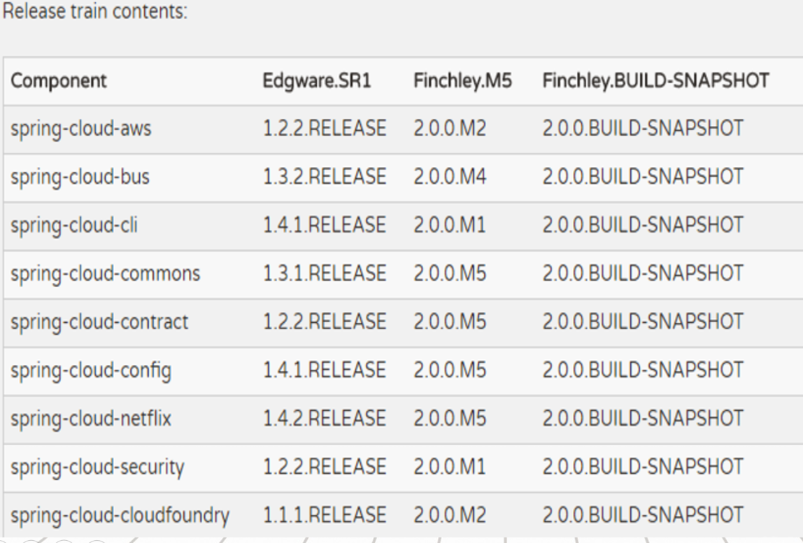
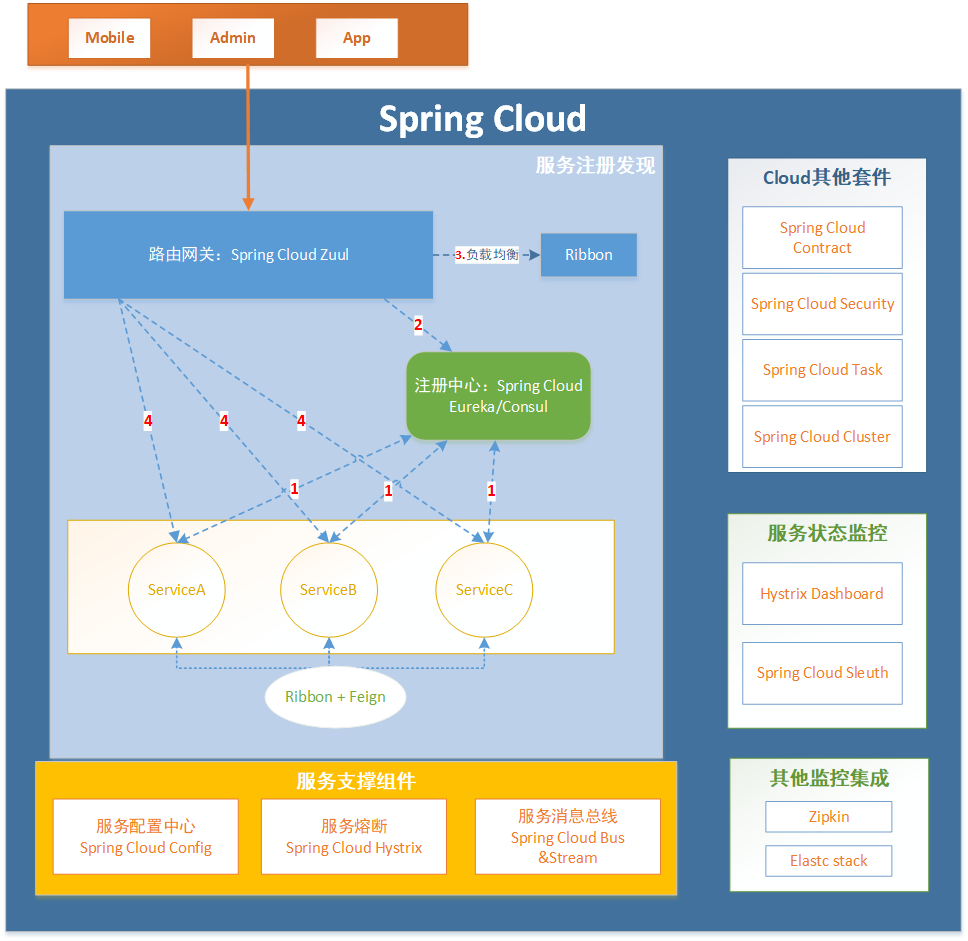
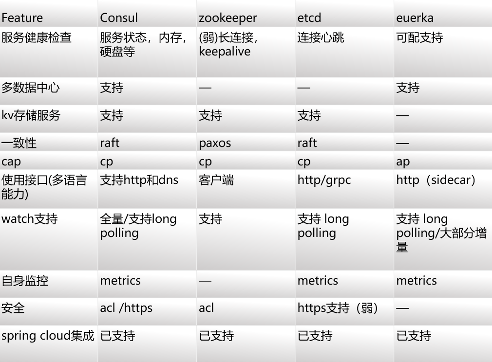
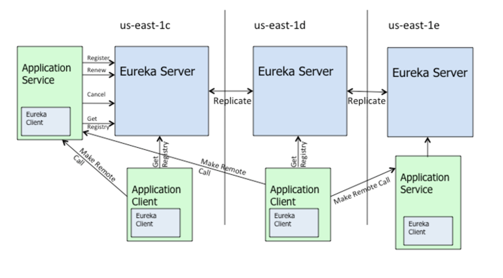
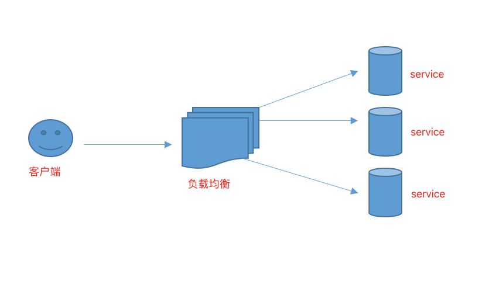
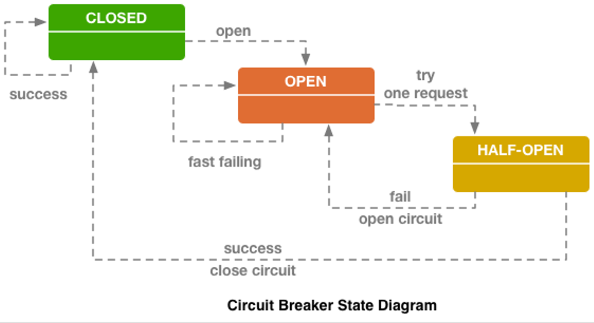
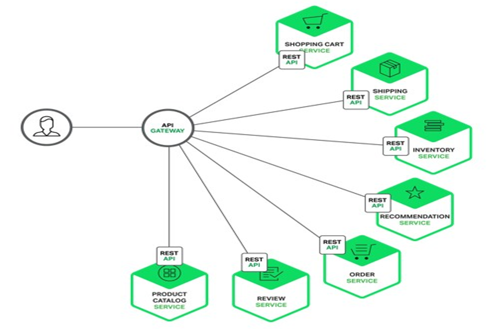
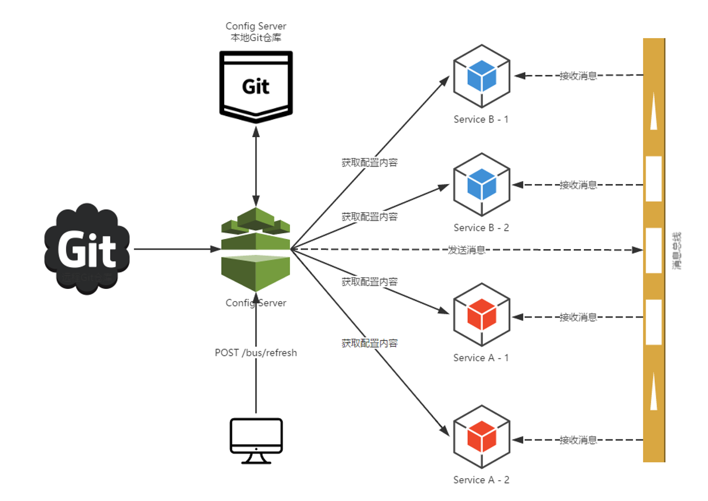

## Spring Cloud内容综述
### 什么是微服务  
微服务是指开发一个单个小型的但有业务功能的服务，每个服务都有自己的处理和轻量通讯机制，可以部署在单个或多个服务器上。微服务也指一种种松耦合的、有一定的有界上下文的面向服务架构。也就是说，如果每个服务都要同时修改，那么它们就不是微服务，因为它们紧耦合在一起；如果你需要掌握一个服务太多的上下文场景使用条件，那么它就是一个有上下文边界的服务，这个定义来自DDD领域驱动设计。

相对于单体架构和SOA，它的主要特点是组件化、松耦合、自治、去中心化，体现在以下几个方面：

* 一组小的服务   
服务粒度要小，而每个服务是针对一个单一职责的业务能力的封装，专注做好一件事情。

* 独立部署运行和扩展  
 每个服务能够独立被部署并运行在一个进程内。这种运行和部署方式能够赋予系统灵活的代码组织方式和发布节奏，使得快速交付和应对变化成为可能。

* 独立开发和演化  
 技术选型灵活，不受遗留系统技术约束。合适的业务问题选择合适的技术可以独立演化。服务与服务之间采取与语言无关的API进行集成。相对单体架构，微服务架构是更面向业务创新的一种架构模式。

* 独立团队和自治  
 团队对服务的整个生命周期负责，工作在独立的上下文中，自己决策自己治理，而不需要统一的指挥中心。团队和团队之间通过松散的社区部落进行衔接。  
 > 

        我们可以看到整个微服务的思想就如我们现在面对信息爆炸、知识爆炸是一样的：  
		通过解耦我们所做的事情，分而治之以减少不必要的损耗，使得整个复杂的系统和组织能够快速的应对变化。  
		
### Spring Cloud 简介  
Spring Cloud 是一系列框架的有序集合，它利用 Spring Boot 的开发便利性巧妙地简化了分布式系统基础设施的开发，如服务发现注册、配置中心、消息总线、负载均衡、断路器、数据监控等，都可以用 Spring Boot 的开发风格做到一键启动和部署。
核心功能：
* 分布式/版本化配置  
* 服务注册和发现  
* 路由  
* 服务和服务之间的调用  
* 负载均衡  
* 断路器  
* 分布式消息传递  
> Spring Cloud并没有重复制造轮子，它只是将目前各家公司开发的比较成熟、经得起实际考验的服务框架组合起来，通过 Spring Boot 风格进行再封装、屏蔽掉了复杂的配置和实现原理，最终给开发者留出了一套简单易懂、易部署和易维护的分布式系统开发工具包。  

### Spring Cloud 版本简介  
  
版本名称采用了伦敦地铁站的名字，根据字母表的顺序来对应版本时间顺序
当个别项目发布积累到临界点或者解决了其中一个严重的bug时。将会发布一个名为“.SRX”的 “service releases”版本。其中“X”是数字，依次递增.
Spring Cloud自身有个大版本，每个大版本下，各组件又有自身的版本。
#### F版本
F版本是个绝对的大版本，几乎所有组件，全部同步变更版本号为2.x。
#### 小版本
* SNAPSHOT  
快照版本，随时可能修改
* M： MileStone  
M1表示第1个里程碑版本，一般同时标注PRE，表示预览版版。
* SR： Service Release  
SR1表示第1个正式版本，一般同时标注GA：(GenerallyAvailable),表示稳定版本。  

### Spring Cloud 组件概览  
   
> 所有请求都统一通过 API 网关(Zuul)来访问内部服务。  
网关接收到请求后，从注册中心(Eureka)获取可用服务。  
由 Ribbon 进行均衡负载后，分发到后端的具体实例。  
微服务之间通过 Feign 进行通信处理业务。  
Hystrix 负责处理服务超时熔断。  
Turbine 监控服务间的调用和熔断相关指标。  

### Spring Cloud 注册与发现  
Spring Cloud Eureka VS Spring Cloud Consul VS Spring Cloud Zookeeper  
  
> 可基于分布式一致性-CAP理论基础进行比较，Eureka 典型的 AP,作为分布式场景下的服务发现的产品较为合适，服务发现场景的可用性优先级较高，一致性并不是特别致命。 Consul是CP类型 ，能 k-v store 服务保证一致性，利用此存储能力提供了配置管理的能力。 在服务发现场景并没太大优势；Zookeeper,Etcd,也是CP类型。

### Spring Cloud 注册与发现 - Eureka  
服务的注册发现和LB  
 Spring Cloud Netflix通过Eureka Server实现服务注册中心，通过Ribbon实现软负载均衡, 高可用结构：  
     
> Zone
Eureka支持Region和Zone的概念。其中一个Region可以包含多个Zone。Eureka在启动时需要指定一个Zone名，即当前Eureka属于哪个zone, 如果不指定则属于defaultZone。Eureka Client也需要指定Zone, Client(当与Ribbon配置使用时)在向Server获取注册列表时会优先向自己Zone的Eureka发请求，如果自己Zone中的Eureka全挂了才会尝试向其它Zone。当获取到远程服务列表后，Client也会优先向同一个Zone的服务发起远程调用。Region和Zone可以对应于现实中的大区和机房，如在华北地区有10个机房，在华南地区有20个机房，那么分别为Eureka指定合理的Region和Zone能有效避免跨机房调用，同时一个地区的Eureka坏掉不会导致整个该地区的服务都不可用。  

### Spring Cloud Feign 声明式调用  
Feign与Apache Http Client这类客户端最大的不同，是它允许你通过定义接口的形式构造HTTP请求，不需要手动拼参数，使用起来与正常的本地调用没有什么区别：  
``` java  
@FeignClient(value = "service-hi",fallback = HiHystric.class)
public interface IServiceHi {
    @RequestMapping(value = "/hi", method = RequestMethod.GET)
    String sayHiFromClientOne(@RequestParam(value = "name") String name);
}
  
```  
### Spring Cloud Ribbon 软负载均衡  
Netfilx发布的负载均衡器，是一个基于http、tcp的客户端负载均衡工具，具有控制http、tcp客户端的行为，为ribbon配置服务提供者的地址后，  
ribbon就可以经过springCloud的封装实心客户端负载均衡的服务调用。     
     

### Spring Cloud Hystrix 断路器   
断路器可以防止一个应用程序多次试图执行一个操作，即很可能失败，允许它继续而不等待故障恢复或者浪费   
CPU周期，而它确定该故障是持久的。断路器模式也使应用程序能够检测故障是否已经解决。如果问题似乎已经得到纠正​​，应用程序可以尝试调用操作。   
     
* 断路器机制

断路器很好理解, 当Hystrix Command请求后端服务失败数量超过一定比例(默认50%), 断路器会切换到开路状态(Open). 这时所有请求会直接失败而不会发送到后端服务. 断路器保持在开路状态一段时间后(默认5秒), 自动切换到半开路状态(HALF-OPEN). 这时会判断下一次请求的返回情况, 如果请求成功, 断路器切回闭路状态(CLOSED), 否则重新切换到开路状态(OPEN). Hystrix的断路器就像我们家庭电路中的保险丝, 一旦后端服务不可用, 断路器会直接切断请求链, 避免发送大量无效请求影响系统吞吐量, 并且断路器有自我检测并恢复的能力.

* Fallback

Fallback相当于是降级操作. 对于查询操作, 我们可以实现一个fallback方法, 当请求后端服务出现异常的时候, 可以使用fallback方法返回的值. fallback方法的返回值一般是设置的默认值或者来自缓存.

* 资源隔离

在Hystrix中, 主要通过线程池来实现资源隔离. 通常在使用的时候我们会根据调用的远程服务划分出多个线程池. 例如调用产品服务的Command放入A线程池, 调用账户服务的Command放入B线程池. 这样做的主要优点是运行环境被隔离开了. 这样就算调用服务的代码存在bug或者由于其他原因导致自己所在线程池被耗尽时, 不会对系统的其他服务造成影响. 但是带来的代价就是维护多个线程池会对系统带来额外的性能开销. 如果是对性能有严格要求而且确信自己调用服务的客户端代码不会出问题的话, 可以使用Hystrix的信号模式(Semaphores)来隔离资源. 

###   Spring Cloud Zuul - 网关服务   
在微服务架构模式下后端服务的实例数一般是动态的，对于客户端而言很难发现动态改变的服务实例的访问地址信息。
因此在基于微服务的项目中为了简化前端的调用逻辑，通常会引入API Gateway作为轻量级网关，同时API Gateway中也会实现相关的认证逻辑从而简化内部服务之间相互调用的复杂度  

__Zuul的能力__
* 服务路由
* 负载均衡
* 权限控制
* 统一异常处理
   

###   Spring Cloud Config - 配置中心
#### 特点
* 分布式的外部化配置
* Spring Environment和PropertySource抽象的映射
* 方便的区分dev、test、pro配置
* 支持git、svn、文件存储
* 动态刷新配置
	- Spring cloud bus支撑    

    
 
###   其他    
还有其他一些组件，后续文章介绍介绍：  
* Spring Cloud Turbine  
* Spring Cloud Sleuth  
* Spring Cloud Stream  
* Spring Cloud Contract  


 


