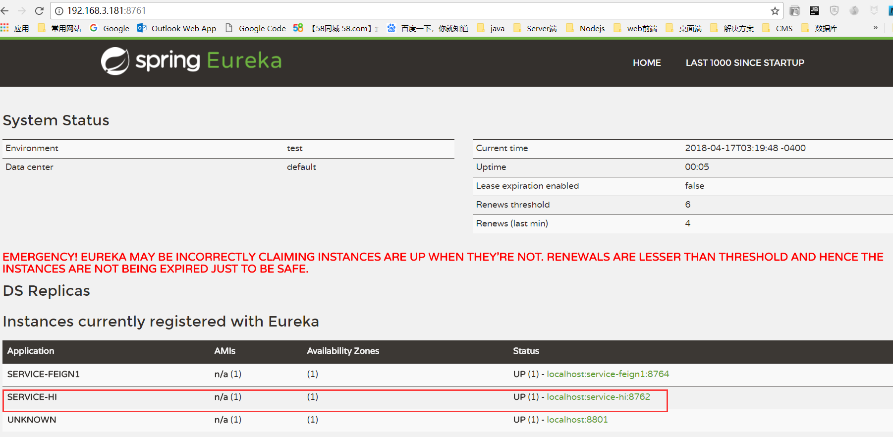

## Spring Cloud Quick Start - 服务发现 

### 实验环境说明  

* Spring Cloud - Finchley.M9
* Spring Boot - 2.0.0.RELEASE     
* Maven(实验环境为了方便，使用maven进行) 

### 服务项目名称
服务注册中心：test-eureka-server  
__服务1：test-eureka-client1(本文)__    
服务2：test-eureka-client2  
路由服务：test-zuul    
统一配置配置服务：cloud-config-server  
Spring Boot管理服务：boot-admin

### 服务提供者    

#### 创建服务提供者项目
创建一个Spring Cloud项目：
`test-eureka-client1`       

#### 引入eureka client依赖包    
``` xml    
		<dependency>
			<groupId>org.springframework.cloud</groupId>
			<artifactId>spring-cloud-starter-netflix-eureka-client</artifactId>
		</dependency>
```  

#### 完整`pom`配置信息  
``` xml  
 
<?xml version="1.0" encoding="UTF-8"?>
<project xmlns="http://maven.apache.org/POM/4.0.0" xmlns:xsi="http://www.w3.org/2001/XMLSchema-instance"
	xsi:schemaLocation="http://maven.apache.org/POM/4.0.0 http://maven.apache.org/xsd/maven-4.0.0.xsd">
	<modelVersion>4.0.0</modelVersion>

	<groupId>test.example</groupId>
	<artifactId>eureka-client1</artifactId>
	<version>0.0.1-SNAPSHOT</version>
	<packaging>jar</packaging>

	<name>eureka-client1</name>
	<description>Demo project for Spring Boot</description>

	<parent>
		<groupId>org.springframework.boot</groupId>
		<artifactId>spring-boot-starter-parent</artifactId>
		<version>2.0.0.RELEASE</version>
		<relativePath/> <!-- lookup parent from repository -->
	</parent>

	<properties>
		<project.build.sourceEncoding>UTF-8</project.build.sourceEncoding>
		<project.reporting.outputEncoding>UTF-8</project.reporting.outputEncoding>
		<java.version>1.8</java.version>
		<spring-cloud.version>Finchley.M9</spring-cloud.version>
	</properties>

	<dependencies>
		<dependency>
			<groupId>org.springframework.cloud</groupId>
			<artifactId>spring-cloud-starter-netflix-eureka-client</artifactId>
		</dependency>
		<dependency>
			<groupId>org.springframework.boot</groupId>
			<artifactId>spring-boot-starter-web</artifactId>
		</dependency>
		<dependency>
			<groupId>org.springframework.boot</groupId>
			<artifactId>spring-boot-starter-actuator</artifactId>
		</dependency>
		<dependency>
			<groupId>org.springframework.boot</groupId>
			<artifactId>spring-boot-starter-test</artifactId>
			<scope>test</scope>
		</dependency>
	</dependencies>

	<dependencyManagement>
		<dependencies>
			<dependency>
				<groupId>org.springframework.cloud</groupId>
				<artifactId>spring-cloud-dependencies</artifactId>
				<version>${spring-cloud.version}</version>
				<type>pom</type>
				<scope>import</scope>
			</dependency>
		</dependencies>
	</dependencyManagement>

	<build>
		<plugins>
			<plugin>
				<groupId>org.springframework.boot</groupId>
				<artifactId>spring-boot-maven-plugin</artifactId>
			</plugin>
		</plugins>
	</build>

	<repositories>
		<repository>
			<id>spring-milestones</id>
			<name>Spring Milestones</name>
			<url>https://repo.spring.io/milestone</url>
			<snapshots>
				<enabled>false</enabled>
			</snapshots>
		</repository>
	</repositories>


</project>


```  

#### 配置文件  
`bootstrap.yml`中配置信息：    
主要定义了服务名称，注册中心地址  

``` yml
spring:
  application:
    name: service-hi 
eureka:
  client:
    serviceUrl:
      defaultZone: http://192.168.3.181:8761/eureka/
server:
  port: 8762
```  

#### 启动注解配置    
添加`@EnableEurekaClient`  

``` java  
@SpringBootApplication
@EnableDiscoveryClient
public class EurekaClient1Application {

	public static void main(String[] args) {
		SpringApplication.run(EurekaClient1Application.class, args);
	}
}
  
```       

#### 运行  
启动服务后，在url上浏览注册中心：http://192.168.3.181:8761/      
发现服务service-hi 已注册到Eureka Server。  
  


 

