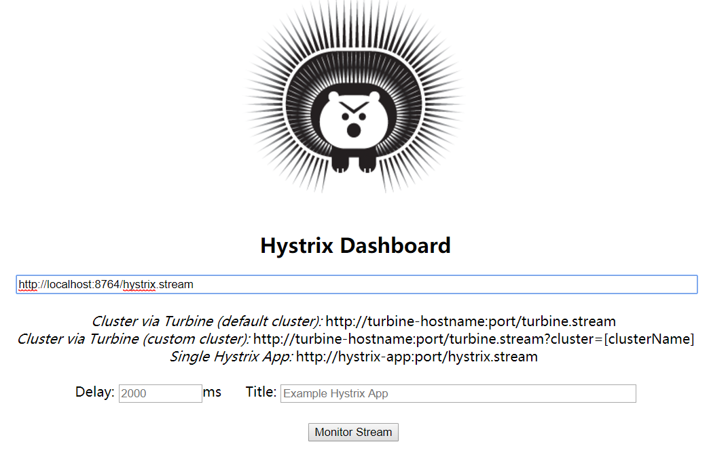

## Spring Cloud Quick Start - 服务熔断Hystric-dashboard
以Feign消费服务为例。

### 实验环境说明  

* Spring Cloud - Finchley.M9
* Spring Boot - 2.0.0.RELEASE     
* Maven(实验环境为了方便，使用maven进行) 

### 服务项目名称
服务注册中心：test-eureka-server  
服务1：test-eureka-client1   
__服务2：test-eureka-client2(本文)__   
路由服务：test-zuul    
统一配置配置服务：cloud-config-server  
Spring Boot管理服务：boot-admin

#### 监控Hystric-dashboard依赖包引入
还是基于之前的`test-eureka-client2`     
``` xml    
		<dependency>
			<groupId>org.springframework.cloud</groupId>
			<artifactId>spring-cloud-starter-netflix-hystrix</artifactId>
		</dependency>
		
		<dependency>
			<groupId>org.springframework.cloud</groupId>
			<artifactId>spring-cloud-starter-netflix-hystrix-dashboard</artifactId>
		</dependency>  
```


#### 完整`pom`配置信息  
``` xml  
<?xml version="1.0" encoding="UTF-8"?>
<project xmlns="http://maven.apache.org/POM/4.0.0" xmlns:xsi="http://www.w3.org/2001/XMLSchema-instance"
	xsi:schemaLocation="http://maven.apache.org/POM/4.0.0 http://maven.apache.org/xsd/maven-4.0.0.xsd">
	<modelVersion>4.0.0</modelVersion>

	<groupId>test.example</groupId>
	<artifactId>eureka-client2</artifactId>
	<version>0.0.1-SNAPSHOT</version>
	<packaging>jar</packaging>

	<name>eureka-client2</name>
	<description>Demo project for Spring Boot</description>

	<parent>
		<groupId>org.springframework.boot</groupId>
		<artifactId>spring-boot-starter-parent</artifactId>
		<version>2.0.0.RELEASE</version>
		<relativePath/> <!-- lookup parent from repository -->
	</parent>

	<properties>
		<project.build.sourceEncoding>UTF-8</project.build.sourceEncoding>
		<project.reporting.outputEncoding>UTF-8</project.reporting.outputEncoding>
		<java.version>1.8</java.version>
		<spring-cloud.version>Finchley.M9</spring-cloud.version>
	</properties>

	<dependencies>
		<dependency>
			<groupId>org.springframework.cloud</groupId>
			<artifactId>spring-cloud-starter-netflix-eureka-client</artifactId>
		</dependency>

		<dependency>
			<groupId>org.springframework.boot</groupId>
			<artifactId>spring-boot-starter-actuator</artifactId>
		</dependency>

		<dependency>
			<groupId>org.springframework.boot</groupId>
			<artifactId>spring-boot-starter-web</artifactId>
		</dependency>

		<dependency>
			<groupId>org.springframework.boot</groupId>
			<artifactId>spring-boot-starter-test</artifactId>
			<scope>test</scope>
		</dependency>

		<dependency>
			<groupId>org.springframework.cloud</groupId>
			<artifactId>spring-cloud-starter-netflix-hystrix</artifactId>
		</dependency>

		<dependency>
			<groupId>org.springframework.cloud</groupId>
			<artifactId>spring-cloud-starter-netflix-hystrix-dashboard</artifactId>
		</dependency>

		<dependency>
			<groupId>org.springframework.cloud</groupId>
			<artifactId>spring-cloud-starter-openfeign</artifactId>
		</dependency>

	</dependencies>

	<dependencyManagement>
		<dependencies>
			<dependency>
				<groupId>org.springframework.cloud</groupId>
				<artifactId>spring-cloud-dependencies</artifactId>
				<version>${spring-cloud.version}</version>
				<type>pom</type>
				<scope>import</scope>
			</dependency>
			<dependency>
				<groupId>org.springframework.cloud</groupId>
				<artifactId>spring-cloud-openfeign</artifactId>
				<version>2.0.0.M1</version>
				<type>pom</type>
				<scope>import</scope>
			</dependency>
		</dependencies>
	</dependencyManagement>

	<build>
		<plugins>
			<plugin>
				<groupId>org.springframework.boot</groupId>
				<artifactId>spring-boot-maven-plugin</artifactId>
			</plugin>
		</plugins>
	</build>

	<repositories>
		<repository>
			<id>spring-milestones</id>
			<name>Spring Milestones</name>
			<url>https://repo.spring.io/milestone</url>
			<snapshots>
				<enabled>false</enabled>
			</snapshots>
		</repository>
	</repositories>


</project>

```  

#### 配置文件  
无需`Hystric-dashboard`的配置变更

#### 启动注解配置    
添加`@EnableHystrixDashboard` 

``` java  
@SpringBootApplication
@EnableCircuitBreaker
@EnableDiscoveryClient
@EnableFeignClients
@EnableHystrix
@EnableHystrixDashboard
public class EurekaClient2Application {

	public static void main(String[] args) {
		SpringApplication.run(EurekaClient2Application.class, args);
	}
}

  
```       

 
#### 运行  
到这里我们已经完成了基本配置，接下来我们可以启动该应用，并访问：http://localhost:8764/hystrix，我们可以看到如下页面：  
   

### 问题  
无法获取stream监控信息`Unable to connect to Command Metric Stream.`, 社区有人提，应该是最新版本Finchley.M9尚未集成的问题，目前还没有解决。


 

