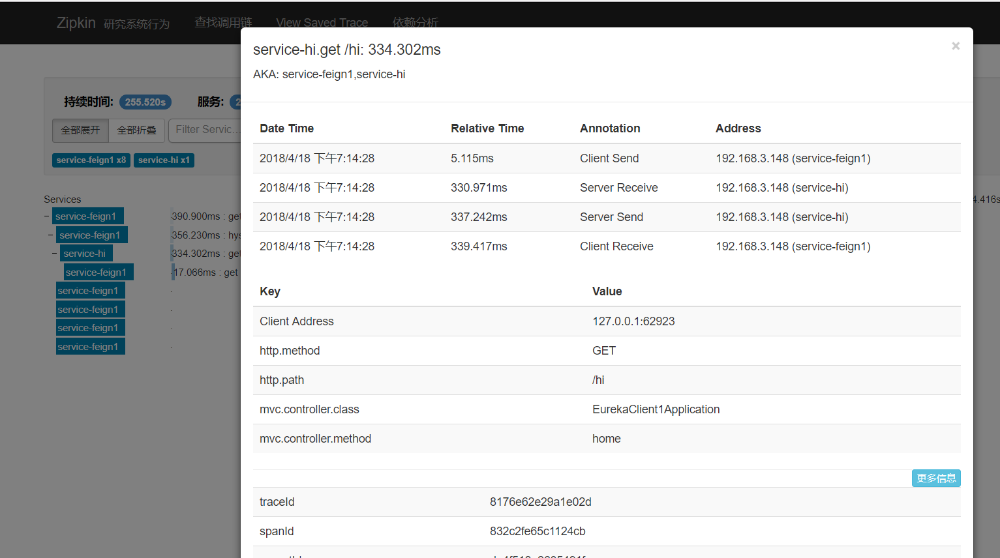

## Spring Cloud Quick Start - 服务跟踪Sleuth与zipkin集成   
   

Zipkin是一个分布式追踪系统。它有助于收集解决微服务架构中延迟问题所需的时序数据。它管理这些数据的收集和查找。Zipkin是基于 Google Dapper论文的设计。

应用程序用于向Zipkin报告时序数据。Zipkin用户界面还提供了一个依赖关系图，显示每个应用程序有多少跟踪请求。  
如果您正在解决延迟问题或错误问题，则可以根据应用程序，跟踪长度，注释或时间戳过滤或排序所有跟踪。  
一旦选择了一个跟踪，您可以看到每个跨度所花费的总跟踪时间的百分比，从而可以确定问题应用程序。   
* 数据收集流程：   
    


### 实验环境说明  
还是以`test-eureka-client1、test-eureka-client2`服务为例。
* Spring Cloud - Finchley.M9
* Spring Boot - 2.0.0.RELEASE     
* Maven(实验环境为了方便，使用maven进行)   


### 搭建zipkin server  
* 前置条件 jdk8  
* 安装  
在服务器执行：
``` shell   
curl -sSL https://zipkin.io/quickstart.sh | bash -s
java -jar zipkin.jar 
```

### 服务项目名称
服务注册中心：test-eureka-server  
__服务1：test-eureka-client1__  
__服务2：test-eureka-client2__   
路由服务：test-zuul    
统一配置配置服务：cloud-config-server  
Spring Boot管理服务：boot-admin  


#### 监控Sleuth与zipkin依赖包引入
`spring-cloud-starter-sleuth、spring-cloud-starter-zipkin`两个服务内都引入    
``` xml    
		<dependency>
			<groupId>org.springframework.cloud</groupId>
			<artifactId>spring-cloud-starter-sleuth</artifactId>
		</dependency>
		<dependency>
			<groupId>org.springframework.cloud</groupId>
			<artifactId>spring-cloud-starter-zipkin</artifactId>
		</dependency>

```

#### 完整`pom`配置信息  
``` xml  
<?xml version="1.0" encoding="UTF-8"?>
<project xmlns="http://maven.apache.org/POM/4.0.0" xmlns:xsi="http://www.w3.org/2001/XMLSchema-instance"
	xsi:schemaLocation="http://maven.apache.org/POM/4.0.0 http://maven.apache.org/xsd/maven-4.0.0.xsd">
	<modelVersion>4.0.0</modelVersion>

	<groupId>test.example</groupId>
	<artifactId>eureka-client2</artifactId>
	<version>0.0.1-SNAPSHOT</version>
	<packaging>jar</packaging>

	<name>eureka-client2</name>
	<description>Demo project for Spring Boot</description>

	<parent>
		<groupId>org.springframework.boot</groupId>
		<artifactId>spring-boot-starter-parent</artifactId>
		<version>2.0.0.RELEASE</version>
		<relativePath/> <!-- lookup parent from repository -->
	</parent>

	<properties>
		<project.build.sourceEncoding>UTF-8</project.build.sourceEncoding>
		<project.reporting.outputEncoding>UTF-8</project.reporting.outputEncoding>
		<java.version>1.8</java.version>
		<spring-cloud.version>Finchley.M9</spring-cloud.version>
	</properties>

	<dependencies>
		<dependency>
			<groupId>org.springframework.cloud</groupId>
			<artifactId>spring-cloud-starter-netflix-eureka-client</artifactId>
		</dependency>

		<dependency>
			<groupId>org.springframework.boot</groupId>
			<artifactId>spring-boot-starter-actuator</artifactId>
		</dependency>

		<dependency>
			<groupId>org.springframework.cloud</groupId>
			<artifactId>spring-cloud-starter-sleuth</artifactId>
		</dependency>
		<dependency>
			<groupId>org.springframework.cloud</groupId>
			<artifactId>spring-cloud-starter-zipkin</artifactId>
		</dependency>
		<dependency>
			<groupId>org.springframework.boot</groupId>
			<artifactId>spring-boot-starter-web</artifactId>
		</dependency>

		<dependency>
			<groupId>org.springframework.boot</groupId>
			<artifactId>spring-boot-starter-test</artifactId>
			<scope>test</scope>
		</dependency>

		<dependency>
			<groupId>org.springframework.cloud</groupId>
			<artifactId>spring-cloud-starter-netflix-hystrix</artifactId>
		</dependency>

		<dependency>
			<groupId>org.springframework.cloud</groupId>
			<artifactId>spring-cloud-starter-netflix-hystrix-dashboard</artifactId>
		</dependency>

		<dependency>
			<groupId>org.springframework.cloud</groupId>
			<artifactId>spring-cloud-starter-openfeign</artifactId>
		</dependency>

	</dependencies>

	<dependencyManagement>
		<dependencies>
			<dependency>
				<groupId>org.springframework.cloud</groupId>
				<artifactId>spring-cloud-dependencies</artifactId>
				<version>${spring-cloud.version}</version>
				<type>pom</type>
				<scope>import</scope>
			</dependency>
			<dependency>
				<groupId>org.springframework.cloud</groupId>
				<artifactId>spring-cloud-openfeign</artifactId>
				<version>2.0.0.M1</version>
				<type>pom</type>
				<scope>import</scope>
			</dependency>
		</dependencies>
	</dependencyManagement>

	<build>
		<plugins>
			<plugin>
				<groupId>org.springframework.boot</groupId>
				<artifactId>spring-boot-maven-plugin</artifactId>
			</plugin>
		</plugins>
	</build>

	<repositories>
		<repository>
			<id>spring-milestones</id>
			<name>Spring Milestones</name>
			<url>https://repo.spring.io/milestone</url>
			<snapshots>
				<enabled>false</enabled>
			</snapshots>
		</repository>
	</repositories>


</project>


```  

#### 配置文件    
两个服务的`application.yml`内都设置`zipkin`  

```  yml
spring:
   zipkin:
    baseUrl: http://192.168.3.181:9411/
    sender:
      type: web
```
     
#### 运行
分别启动服务`test-eureka-client1、test-eureka-client2` ,其中服务2的/hic路由方法内会调用服务1的/hi方法。  
我们访问：`http://localhost:8764/hic?name=123`   
* 查看http://192.168.3.181:9411/zipkin  
 



 

